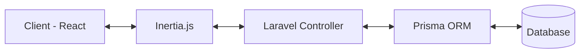

# 🎟️ EventHub: Event Registration System

[](https://laravel.com)
[](https://reactjs.org)
[](https://tailwindcss.com)
[](https://prisma.io)

> **Upgrade Skill Kamu Di Event Kampus.** > Sebuah ekosistem manajemen event modern untuk membuat, mengelola, dan memonitor pendaftaran secara real-time dengan pengalaman UI yang asik.

---

## 📌 Overview

Sistem pendaftaran event berbasis web yang dirancang untuk efisiensi koordinasi antara penyelenggara (Admin) dan peserta (User).

- **Admin:** Kendali penuh atas pembuatan event dan manajemen data.
- **User:** Pendaftaran seamless dengan antarmuka yang intuitif.
- **Data Driven:** Monitoring kuota real-time dan ekspor data CSV dalam satu klik.

---

## 🏗️ Tech Stack

Platform ini dibangun dengan teknologi *cutting-edge* untuk memastikan performa maksimal:

| Layer | Technology |
| :--- | :--- |
| **Backend** | Laravel 10+ |
| **Frontend** | React (Inertia.js) |
| **Styling** | TailwindCSS |
| **ORM** | Prisma |
| **Database** | MySQL / PostgreSQL |
| **Auth** | Laravel Breeze |
| **Build Tool** | Vite |

---

## ⚡ Quick Start (UI Only / Dummy Mode)

Ingin eksplorasi UI tanpa ribet urusan database? Jalankan ini:

```bash
# Install dependencies
composer install && npm install

# Setup env
cp .env.example .env && php artisan key:generate

# Run development servers
# Terminal 1: Laravel
php artisan serve

# Terminal 2: Vite
npm run dev

```

Akses di: `http://localhost:8000`

---

## ⚙️ Full Installation (Database Mode)

1. **Requirements:** PHP 8.1+, Node.js 18+, MySQL/PostgreSQL.
2. **Setup Database:** Edit `.env` dan sesuaikan `DATABASE_URL` untuk Prisma:
```env
DB_DATABASE=event_system
DATABASE_URL="mysql://root:@127.0.0.1:3306/event_system"

```


3. **Migrate & Generate:**
```bash
npx prisma migrate dev --name init
npx prisma generate

```


4. **Run:** `php artisan serve` & `npm run dev`.

---

## 🧠 System Architecture



---

## 👥 Role & Permissions

### 🛠️ Admin

* **Event Lifecycle:** Create, Edit, Delete, Publish, and Close events.
* **Management:** Monitor participants in real-time.
* **Reporting:** Export participant data to CSV.
* **Analytic:** View statistics on dashboard.

### 👤 User

* **Browse:** Mencari event aktif dengan filter kategori.
* **Registration:** Form pendaftaran otomatis divalidasi.
* **Confirmation:** Mendapatkan notifikasi status pendaftaran.

---

## 🗄️ Database Structure

| Entity | Fields |
| --- | --- |
| **User** | `id`, `name`, `email`, `password`, `role (ADMIN/USER)` |
| **Event** | `id`, `title`, `description`, `date`, `quota`, `status` |
| **Participant** | `id`, `name`, `nim`, `email`, `status`, `eventId` |

> **Constraint:** Satu email hanya diperbolehkan mendaftar satu kali per event untuk mencegah spam.

---

## 📂 Project Structure

```text
app/
├── Http/Controllers/    # Logic Controller
├── Services/            # Prisma Service Integration
resources/js/
├── Pages/               # React Page Components
├── Components/          # Reusable UI Components
├── Layouts/             # App Base Layouts
prisma/
└── schema.prisma        # Database Schema Definition

```

---

## 🛠️ Development Commands

* `npx prisma studio` - Buka GUI database Prisma.
* `php artisan test` - Jalankan unit testing.
* `npm run build` - Compile assets untuk produksi.

---

<p align="center">
Crafted with 🖤 for the best campus experience.
</p>

```

-----

### Tips Tambahan untuk GitHub:

1.  **Screenshot:** Tambahkan screenshot dashboard kamu di bawah bagian **Overview**. Gunakan tag `` agar ukurannya pas.
2.  **Mermaid Diagram:** GitHub mendukung rendering Mermaid secara native (seperti yang saya tulis di atas), jadi diagram arsitekturnya akan muncul sebagai grafik asli, bukan teks.
3.  **Badge:** Badge di bagian paling atas otomatis mengambil status terkini jika kamu menghubungkannya dengan GitHub Actions.

Apakah ada bagian fitur spesifik yang ingin kamu tambahkan penjelasannya?

```
